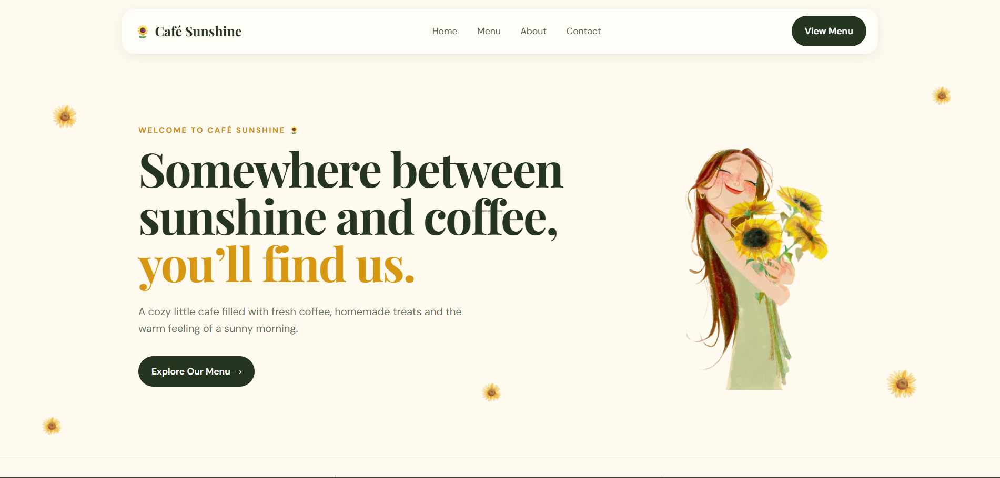

# Landing Page - Café Sunshine

A warm and responsive café landing page designed with a **sunshine and sunflower-inspired theme**.
The website presents Café Sunshine, its menu, story, contact details, and newsletter section in a clean and modern layout.

---

## Features

* Hero section with café introduction
* Featured café items and menu section
* About/Our Story section
* Café quote section
* Contact and location information
* Email subscription section
* Fully responsive design
* Smooth scrolling navigation
* Clean and minimal UI
* Floating sunflower animations
* Google Fonts integration

---

## Technologies Used

* HTML5
* CSS3
* Google Fonts
* Responsive Web Design

---

## 📂 Project Structure

Café-Sunshine/
│
├── index.html
├── style.css
│
├── images/
│   ├── sunflower.png
│   ├── Instagram-removebg-preview.png
│   ├── sunshine cappacino image.png
│   ├── Mango cheescake image.png
│   ├── sandwich image.png
│   ├── shake.png
│   ├── Sushi.jpeg
│   ├── hotpot.jpeg
│   └── cafe.png
│
├── screenshot.png
│
└── README.md

---

## Responsive Design

The website is designed to work across different screen sizes, including:

* 💻 Desktop
* 📱 Mobile
* 📲 Tablet

CSS media queries are used to adjust the layout, navigation, menu cards, images, contact section, and footer for smaller screens.

---

## Design

The website follows a warm café aesthetic using:

* Cream and off-white backgrounds
* Green accents
* Golden/yellow highlights
* Playfair Display for headings
* DM Sans for body text
* Sunflower elements and animations

---

## 📸 Screenshot

---

## Author

**Ankita Hirmukhe**

---

## Purpose

This project was created for **educational and learning purposes** to practice and improve front-end web development skills using HTML and CSS.
