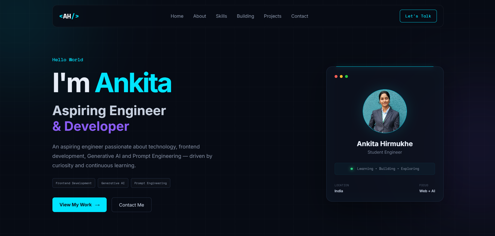
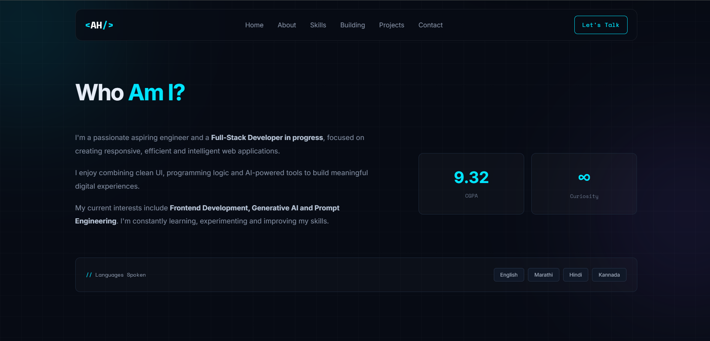
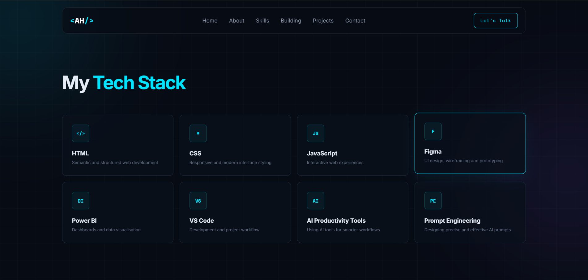
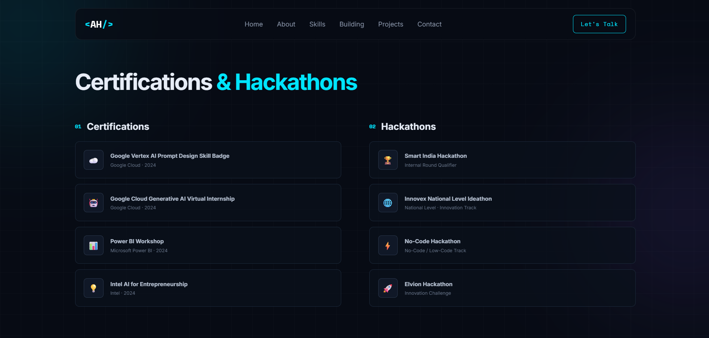

# Portfolio Website

A modern and responsive personal portfolio website designed with a **dark, developer-inspired theme**.  
The website showcases my introduction, skills, projects, achievements, education, and contact information in a clean and professional layout.

---

## Features

* Hero section with personal introduction
* About Me section
* Skills and technologies section
* Areas currently building in
* Projects showcase
* Achievements and certifications section
* Education section
* Languages section
* Contact section
* GitHub and social links
* Responsive design for different screen sizes
* Smooth scrolling navigation
* Modern dark-themed UI
* Interactive hover effects
* Profile image section

---

## Technologies Used

* HTML5
* CSS3
* JavaScript
* Google Fonts
* Responsive Web Design

---

## Project Structure
```text
Portfolio/
│
├── index.html
├── style.css
├── script.js
│
├── images/
│   ├── image1.jpg
│   ├── image2.png
│   ├── image3.png
│   └── image4.png
│   
│
└── README.md
```
---

## Responsive Design

The website is designed to work across different screen sizes, including:

* 💻 Desktop
* 📱 Mobile
* 📲 Tablet

CSS media queries are used to adjust the navigation, hero section, skills, projects, education, contact section, and other content for smaller screens.

---

## Design

The website follows a modern developer-focused aesthetic using:

* Dark background
* Cyan and purple accent colors
* Glassmorphism-inspired cards
* Space Mono and Inter fonts
* Grid background effects
* Glow effects
* Rounded cards and buttons
* Smooth hover animations
* Clean and minimal layout

---

## 📸 Screenshot









---

## Author

**Ankita Hirmukhe**

---

## Purpose

This project was created for **educational and learning purposes** to practice and improve front-end web development skills using HTML, CSS, and JavaScript.
