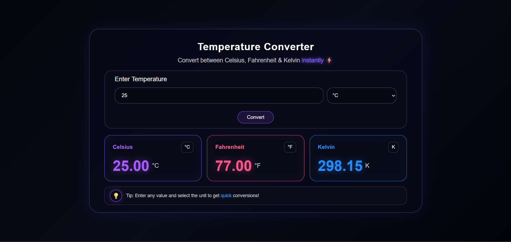
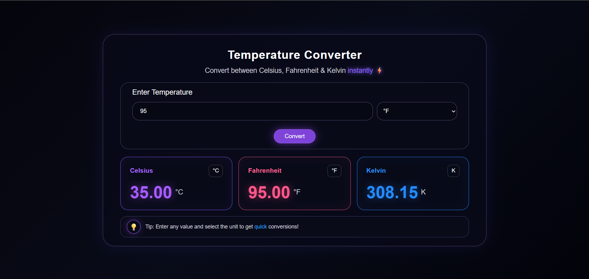

# Temperature Converter

A simple, responsive temperature conversion web application that allows users to convert temperatures between **Celsius, Fahrenheit, and Kelvin** instantly. The project features a clean dark-themed interface with responsive cards and validation messages.

---

## Features

* Convert temperatures between Celsius, Fahrenheit & Kelvin
* Select the input temperature unit
* Instant conversion results
* Input validation for empty values
* Input validation for invalid numbers
* Absolute zero validation
* Displays results in all three temperature units
* Fully responsive design
* Clean and modern dark-themed UI
* Separate result cards for each temperature unit
* Helpful conversion tip section

---

## Technologies Used

* HTML5
* CSS3
* JavaScript
* Responsive Web Design

---

## Project Structure

```text
WebDev-L1-TemperatureConverter/
│
├── images/
│   ├── image1.png
│   ├── image2.png
│   ├── image3.png
│   └── image4.png
│
├── index.html
├── style.css
├── script.js
└── README.md
```

---

## How It Works

Enter a temperature value, select its unit, and click the **Convert** button.

The application then converts the entered value into:

* Celsius (°C)
* Fahrenheit (°F)
* Kelvin (K)

The JavaScript handles the conversion calculations, input validation, and result display.

---

## Responsive Design

The website is designed to work across different screen sizes, including:

* Desktop
* Mobile
* Tablet

CSS media queries are used to adjust the layout, input fields, conversion cards, text sizes, and spacing for smaller screens.

---

## Design

The website follows a modern dark-themed aesthetic using:

* Dark gradient background
* Purple, pink, and blue accent colors
* Glowing borders and shadows
* Rounded cards and input fields
* Separate color styling for Celsius, Fahrenheit, and Kelvin
* Minimal and clean interface
* Responsive layout

The main interface contains an input section followed by three result cards for Celsius, Fahrenheit, and Kelvin.

---

## Screenshot



---

## Author

**Ankita Hirmukhe**

---

## Purpose

This project was created for **educational and learning purposes** to practice and improve front-end web development skills using HTML, CSS, and JavaScript.
