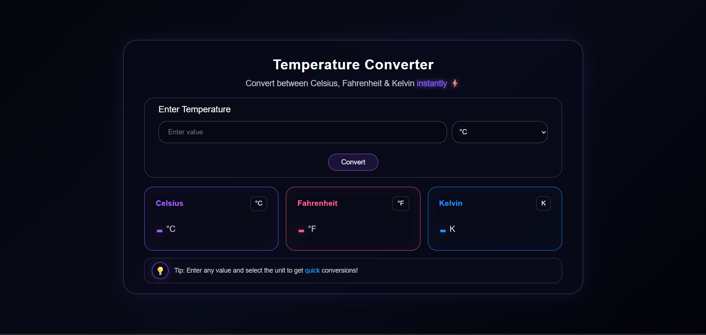

## Temperature Converter

A responsive temperature converter website built using HTML, CSS, and Vanilla JavaScript.

The project allows users to enter a temperature, select the input unit, and convert it into Celsius, Fahrenheit, and Kelvin. It also includes input validation and handles invalid temperature ranges such as values below absolute zero.

---

## About the Project

This project was created as part of a web development task to practice working with HTML, CSS, and JavaScript.

The main focus of the project was to build a simple but visually appealing interface while making sure the converter works correctly and adapts to different screen sizes.

The interface uses a dark theme with colored result cards to make the converted values easy to distinguish.

---

## Features

- 🌡️ Convert temperatures between Celsius, Fahrenheit, and Kelvin
- 🔽 Dropdown menu for selecting the input unit
- ⚡ Displays all three converted values together
- ❌ Shows an error message for invalid input
- 🚫 Handles temperatures below absolute zero
- 📱 Responsive layout for different screen sizes
- 🎨 Dark-themed user interface
- 💡 Includes a temperature conversion tip
- 🖥️ Designed to fit desktop, tablet, and mobile screen sizes

---

## Technologies Used

- **HTML5** – Used to create the structure of the webpage
- **CSS3** – Used for styling, layout, colors, cards, and responsive design
- **JavaScript** – Used for temperature calculations, validation, and updating the results

---

## Supported Conversions

The converter supports the following conversions:

### Celsius

- Celsius → Fahrenheit
- Celsius → Kelvin

### Fahrenheit

- Fahrenheit → Celsius
- Fahrenheit → Kelvin

### Kelvin

- Kelvin → Celsius
- Kelvin → Fahrenheit

The converter uses standard temperature conversion formulas for the calculations.

---

## Screenshots

---

## Input Validation

The converter checks the entered value before performing the calculation.

It handles:

- Empty input
- Invalid or non-numeric input
- Temperatures below absolute zero

If an invalid value is entered, an error message is displayed instead of showing an incorrect result.

---

## Responsive Design

The layout is designed to work across different screen sizes.

On larger screens, the Celsius, Fahrenheit, and Kelvin result cards are displayed next to each other.

On smaller screens, the result cards adjust their layout to fit the available screen size.

The spacing, font sizes, input fields, and cards are also adjusted for smaller devices.

---

## What I Learned

While working on this project, I practiced:

- Creating a webpage using HTML
- Styling interfaces using CSS
- Working with CSS Flexbox
- Creating responsive layouts using media queries
- Handling user input with JavaScript
- Performing calculations using JavaScript
- Updating HTML elements using the DOM
- Adding input validation
- Handling different input cases
- Designing a simple and user-friendly interface

---

## License

This project was created for learning and practice purposes.
